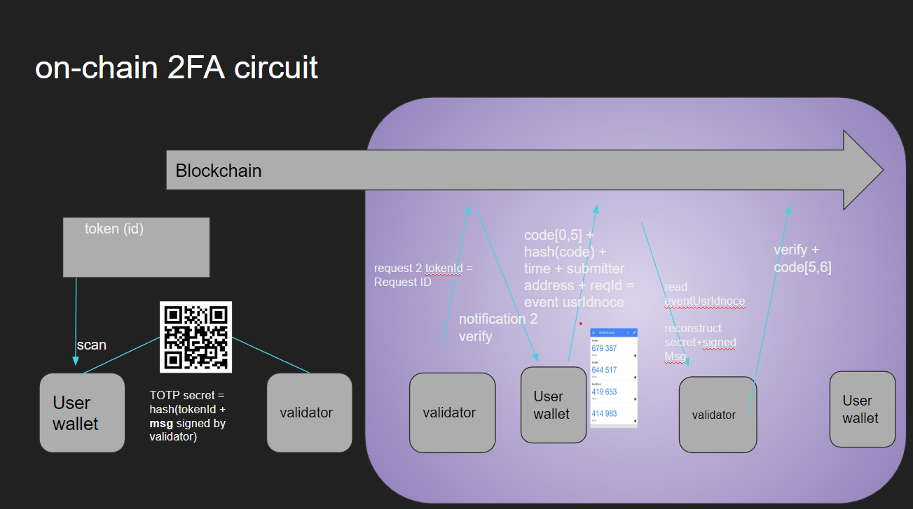
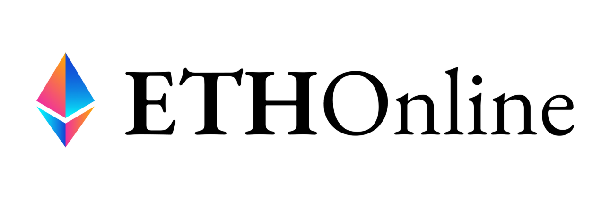

# zkAuth 🗝️🔗

# Zero-Knowledge protected onchain two-factor Authentication  

This project provides 2FA for EVM blockchains, compatible with the broadly adapted timed-one-time-password (TOTP) algorithm. We remove the trusted validator, creating a zero-trust authentication circuit and solve the challenge of on-chain visibility by verification via zero-knowledge proofs.

## The Challenge Statement 📜

The introduction of 2FA has been a big win for cyber security. It's quick and persistent adaptation by the wide public (non-technical audience) is due to its user-friendly interface ([GoogleAuthenticator](https://play.google.com/store/apps/details?id=com.google.android.apps.authenticator2&hl=en_US&gl=US)) and standardized algorithm ([rfc6238](https://www.rfc-editor.org/rfc/rfc6238)).
Yet, this technology is vulnerable and leaves plenty of room for security improvement.
We identified the following attack-vectors:
 - The trusted validator: The issuing party is trusted with validating the authentication request. There is no protection against insider attacks or technical faults on the validators side.
 -  The secret used to generate and validate the TOTP is stored in a centralized database, vulnerable to data breaches, which web2 companies are falling victim to with steadily increasing frequency.
 -  Recovery of mentioned secret is commonly possible through verification of personal data, which is vulnerable to social-engineering attacks. 
 -  The un-hashed, un-encrypted secret is required to authenticate a provided TOTP. Due to the transparency of EVM blockchains, this requirement makes the current 2FA solution unsuitable for onchain authentication and thus incompatible with web3. 

## The Solution: zkAuth 🔐

We present zkAuth, a zero-knowledge and zero-trust based onchain 2FA inspired by ERC4337.
For the sake of mass-adaptation, which we the web3 community strive for, our solution builds on the established TOTP standard, instead of providing an optimized solution which with high probability will get rejected by the public.

**TLDR:**

 - **Compatible with established TOTP apps (e.g. GoogleAuthenticator).**
 - **The critical TOTP generator secret is only displayed to the user.**
 - **Mentioned secret is generated randomly and does not get stored.**
 - **Authentication is validated on-chain, thus cannot be corrupted and is transparent.**
 - **Authentication can be invoked by smart-contracts by cross-calling the zkAuth contracts.**
 - **The zkAuth contracts can be base-class to paymasters of 2nd generation wallets such as ERC4337.**
 - **The generator secret can be recovered through social recovery (zk-protected&onchain-validated).**

## Zero-trust setup

Current TOTP 2FA solutions are based on a shared secret which generates a different password for every moment in time. The trusted validator uses the secret to verify the user.

Our approach removes the trusted validator.
The secret is randomly generated on the frontend and displayed in form of a QR-code to the user only once.
Before discarding the secret, passwords for 2**8 timestamps into the future are generated and hashed together with the corresponding time-step.
A [merkle tree](https://decentralizedthoughts.github.io/2020-12-22-what-is-a-merkle-tree/) is build on top of those hashed.
Once the user authenticates, which proves that he scanned and hopefully securely saved the secret, a authenticator contract containing the merkle-tree's root gets deployed to the blockchain.

We chose the layer 2 solution **OPTIMISM** as our home-chain due to it's scalability, block-time of ~1sec, zero-gas fees and its seriousness.

Neither the merkle-tree nor the hashes which form the leaves of the tree, can be used to infer the secret, nor can an attacker back-propagate the corresponding generation-time of an password-hash.

To further make this solution invulnerable to brute-force attacks, we encrypt the tree with a key signed with the users public key, meaning this key can only by generated by this specific address. 

The full merkle tree is necessary to parse the data needed for onchain authentication with the deployed merkle-tree root.
Earlier implementations od this approach have stored the tree in the browsers local-storage. Needless to say that this solution is sub-optimal for multiple reasons.
We choose for decentralized storage an provide the user the option to store and retrieve the tree from **IPFS**, specifically web3storage, or **CERAMIC**, a protocol for decentralized data composability.

Authentication can be invoked by any smart-contract, wallet or even token when used as modifier. The calldata is put on hold until the user authenticates. Authentication requests emit an event which get's indexed by **theGraph**, a decentralized blockchain indexing protocol. We use these events to inform the user about open authentications and the staged call-data.

The authentication step requires the user to access her/his TOTP generator and the corresponding merkle-tree.
Once a TOTP is provided, it get's hashed together with the current time-step and compared to the leaves of the merkle-tree. If a matching hash is found, the same plus the additional branch-hashes necessary for verification are send to the blockchain. With the initially provided root, it can be verified that the merkle-tree has not been modified. This method is commonly used to prove the integrity of downloaded files and in internet protocols such as TSL to protect against man-in-the middle attacks.

## Social recovery

Web3 is known for the fatal consequences of losing access to the personal private-key.
Inspired by a [talk of Vitalik](https://youtu.be/rp3cDq2LiBM?t=1016) we took a step further and implemented social recovery.

The user-specific authentication contract let's the user assign other wallets as trustees for recovery.

In the case that the user's wallet gets unaccessible or compromised, a recovery process can be initiated.

In a first step the user agrees off-chain (e.g. by phone-call) on trustee-specific and one personal passphrase. For each passphrases, a [SNARK](https://ethereum.org/en/zero-knowledge-proofs/) proof is generated and committed to the blockchain.

Each trustee has then the option to consent to the recovery-process by submitting s SNARK proof of his passphrase.

Once a predefined threshold (at least majority) of consents is reached, the user is able to recover his authentication contract by in a last step, providing the SNARK proofs of his personal passphrase.

<!-- 
is to provide 2FA for EVM compatible blockchains.
We follow a parallel approach for a twofold Authentication solution. The first implements the popular and broadly adopted TOTP 2FA with a trusted validator. The second solution implements a password-generator based zk proof, which is validated onChain providing a zero-trust security level.

Further we provide a dapp to facilitate user-interaction with our smrt-contracts. All dapp interactions can likewise be performed manually per console.

## TOTP 2FA

A picturesque flow-chart of our TOTP 2FA solution:

****## zk 2FA

**Artworq in the making**

## Contribute

Feedback and contributions are always welcome 🤗

 -->
